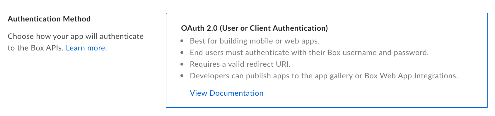
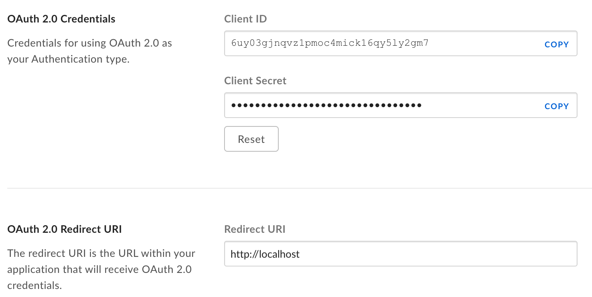
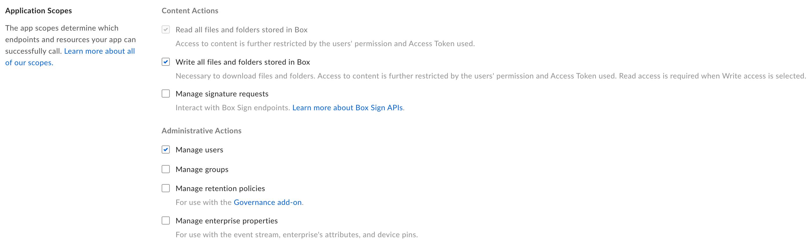
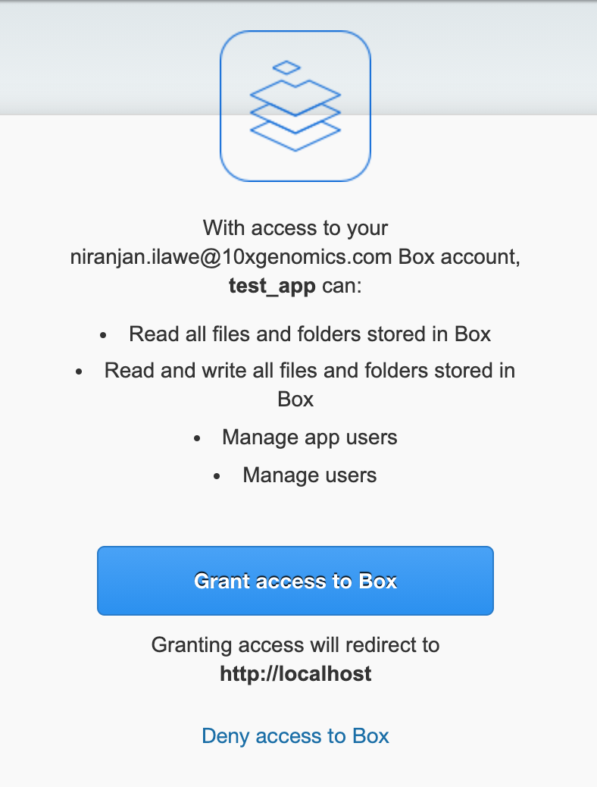
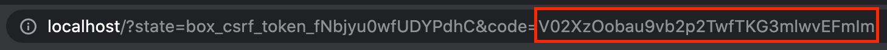

# pybox
* v0.2.5
---
The *pybox* python package was created to simplify connecting to the 10X Box account.
There are also handy functions to recursively search box folders and parse box files

## Functions

Currently the *pybox* package contains the following functions 
1. get_auth_url
2. save_access_refresh_tokens
3. get_box_client
4. box_ls
5. box_parse_excel


The usage of these functions are explained below

## Package Installation

To install the package in python, download the entire repo to your local folder and unzip it. Enter the PyBoxPackage folder and run the commands listed below. *If installing in a virtual environment make sure the env is activated*

`python setup.py build`

and then

`python setup.py install`

The package should now be available for use in python

## Initial Setup

Before you can begin using any of the Box functions, we need to set up a Box developer account and save the access credentials to the local computer. `get_auth_url` and `save_access_refresh_tokens` functions are made to simplify that process

1. Set up Developer account: Go to this link and create a new app https://10xgenomics.app.box.com/developers/console
2. In the "General Settings" tab, give your app a name and enter your email address
3. Under the "Configuration" tab choose the following authentication method:

4. Under the same tab, note down the client ID and client secret and enter the redirect URI as below

5. Check the following permission on the same page.


Now we are ready to authorize the app to make calls without any human interface. Follow the steps below.
*** IMPORTANT: Complete these steps as quickly as possible, since the authorization codes have a really short lifetime. ***
*** NOTE: Also these steps need to be done only once ***
1. Run `get_auth_url(client_id, client_secret)` with your client id and secret and paste the returned URL in your browser
2. On the page that opens grant access to Box.

3. A blank webpage will now open with an address in the address bar.

4. Towards the end of the address copy the string after the `&code=` part. This is the auth_code needed for the next function.
5. Now run the `save_access_refresh_tokens(auth_code)` function pasting your auth_code in it.
6. Run `get_box_client()` to verify if the configuration happened correctly. Function should print `Connected to Box as: <your username>` on the last two lines.
7. You are now ready to use any of the pybox functions

## Usage

1. *get_box_client*

```
from pybox import get_box_client
client = get_box_client()
```

This function does not need any input parameters. It will access the tokens saved in your keyring, provided you have correctly done the previous setup, and return a client object that then can be used to access any box files or run other functions in this package.

2. *box_ls*

```
from pybox import box_ls
client = get_box_client()
files = box_ls(
            client=client,
            folder_id='110021345',
            file_extension="xlsx",
            pattern="Chip",
            last_modified="2021-01-01",
        )
```

`box_ls` can recursively search through a specified Box folder and return list of files that match the specified criteria

3. *box_read_excel_file*

```
from pybox import box_read_excel_file
client = get_box_client()
df = box_read_excel_file(client=client, file_id='100023214', parsing_func=read_chip_yield_rev_F)
```

For reading files from Box, you need to download them and then read them, `box_read_excel_file` provides a wrapper around the actual parsing function which handles the download and cleaning of the Box file.

